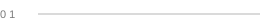

  

 

  Exploring technology, building strong foundations, 
  and discovering where curiosity can take me.

  <a href="https://riccardodelgiudice.github.io/site/">PORTFOLIO</a>
  &nbsp;&nbsp;·&nbsp;&nbsp;
  <a href="https://www.linkedin.com/in/riccardo-del-giudice-029b28332/">LINKEDIN</a>
  &nbsp;&nbsp;·&nbsp;&nbsp;
  <a href="mailto:hello.riccardodelgiudice@gmail.com">EMAIL</a>

 

---

<table>
<tr>

<td width="55%" valign="top">

### ABOUT

First-year **Information Technology student at Ca' Foscari University of Venice**.

Interested in computer science, software and understanding how technology works.

</td>

<td width="45%" valign="top">

### CURRENT FOCUS

`C` &nbsp;&nbsp; `C++`

`Computer Architecture`

 

**FOUNDATIONS**

`Java` &nbsp;&nbsp; `SQL`

`HTML` &nbsp;&nbsp; `CSS` &nbsp;&nbsp; `JavaScript`

</td>

</tr>
</table>

 

---

  
    LEARNING &nbsp;&nbsp;·&nbsp;&nbsp;
    BUILDING &nbsp;&nbsp;·&nbsp;&nbsp;
    GROWING
  

